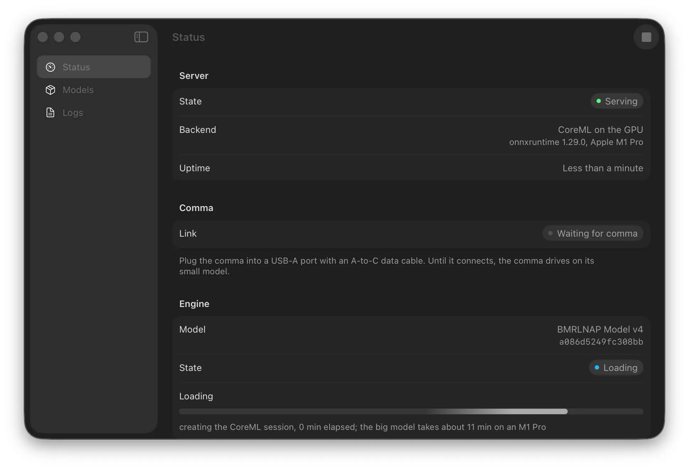
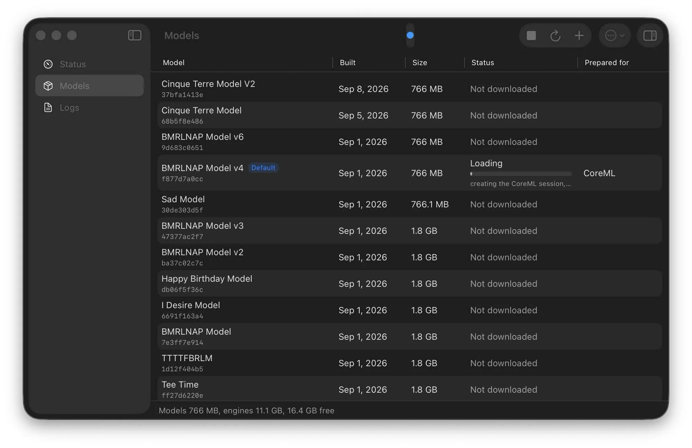
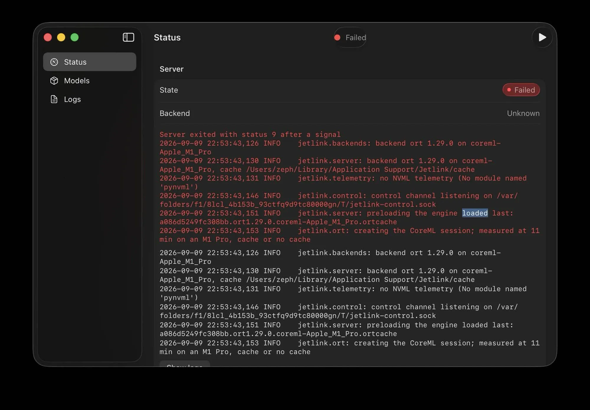

# Jetlink for Mac

Jetlink for Mac runs the server without terminal commands. For the Jetson, see
the [Jetson guide](jetson.md). For the command line on any platform, see
[platform setup](platforms.md).

<a id="what-it-does"></a>

## Requirements

| What you need | Why |
| --- | --- |
| A Mac with Apple silicon | The app is arm64 only. Intel Macs are not supported. |
| macOS 15 or later | The app uses system features added in macOS 15. |
| 16 GB of memory recommended | CoreML preparation uses about 3 GB on an M1 Pro; allow memory for other apps. |
| About 3 GB of disk per model | A 766 MB download plus a 2.1 GB CoreML engine. |
| A USB-A port on a hub, dock or adapter | Going through USB-A makes the Mac take the host role reliably. |
| A USB 3 A-to-C data cable | Charge-only cables do not work. |

You also need a comma running a zoompilot build with Jetlink in it, set up with
the steps in the [README](../README.md#quick-start).

## Install

1. Download the Mac ZIP from [Releases](https://github.com/zoompilot/jetlink/releases).
2. Double-click the ZIP to unzip it, then drag Jetlink.app to Applications.
3. Open Jetlink from Applications.

On first launch the server starts by itself and the Status screen says **Waiting
for comma**. Connect the comma to continue.

### If the build is not signed

Pre-release builds and builds from a fork are not signed by an identified
developer. macOS refuses to open them the first time and says:

> Apple could not verify "Jetlink" is free of malware that may harm your Mac or
> compromise your privacy.

For an unsigned build you trust, use either method:

- Right-click Jetlink in Applications, choose **Open**, and confirm. On recent
  macOS versions you instead open **System Settings > Privacy & Security**,
  find the message about Jetlink, and click **Open Anyway**.
- Or remove the quarantine flag in Terminal:

```bash
xattr -d com.apple.quarantine /Applications/Jetlink.app
```

Signed releases need none of this.

## Plug in

Complete [comma setup](../README.md#comma-setup-all-platforms), including the
branch installation and **Accelerator Link** toggle. Then connect the
**Mac's USB-A port to the comma's USB-C port**, using a USB-A port
on a hub or dock, or a USB-C-to-A adapter. A plain C-to-C cable may not give the
Mac the host role.

The Status screen then shows:

- **Connected over USB** on the Link row.
- **Rate**, the frames per second the comma is sending. It should settle near
  20 per second.
- **Slow frames**, the number of frames over 60 ms in the last second. This should stay at zero. A consistently higher count means the Mac is too slow, and the comma may drop back to its small model.
- **Frame budget**, how much of the comma's 50 ms frame the Mac uses. The
  headline is the room left at p99 (99% of frames take this long or less). The
  bar splits the average frame into Inputs, Model, Overhead and Reply, with p99
  marked against the 50 ms track. The chart shows the last two minutes, with a
  red dot for any second whose slowest frame went over 50 ms. The Mac's time is
  not all of it: the comma's own work and the transfer to the Mac come out of
  the same 50 ms, so keep 10 ms or more to spare.

On the comma, the home-button icon pulses while the model transfers and loads,
then turns green. For driving behavior, see the
[daily use guide](using-jetlink.md).

## Everyday use

Keep the Mac powered and awake. You can close the window; the server keeps
running and the menu bar icon stays. Quitting Jetlink stops the server.
The next launch uses the same model again.

## Use a model before you drive

This is optional. The comma can send the model when it connects, but it then
drives on its small model until the Mac has prepared it. Using the model on the
Mac first avoids that wait.

If you have not changed the model on the comma, click **Use** with the default
model's name on the Status screen. One click downloads it, prepares it for this
Mac and starts using it.

For another model, open **Models**. The list is the same one the comma shows
under **Settings > Models > Big Model**, in the same order. Click **Use Model**
in its row, or double-click the row. The row shows the download, then the
preparation, then **In Use**. The cancel button next to a download stops it.
Right-click a model for everything else: **Stop Using Model**, **Show in
Finder**, and deleting its download or its prepared engines. **Inspector**
(Command-I) shows its checksum, files and engines.

Under each model's name are its date, its size, and what is on this Mac:

| Line under the name | What it means |
| --- | --- |
| Date and size only | The model's file is not on this Mac yet. Use Model downloads it first. |
| Downloaded | The file is on this Mac but has not been prepared. Use Model prepares it. |
| Prepared for CoreML | A compiled engine is on disk. Use Model only has to load it. |

Preparing takes about 20 seconds the first time on an M1 Pro, and loading a
prepared engine takes under a second when it was the last model loaded and up to about
10 seconds otherwise.

<details>
<summary>App screenshots</summary>

These screenshots show an earlier app build.




</details>

## Settings

**General**

| Setting | What it does |
| --- | --- |
| Start server when Jetlink opens | Starts the server as soon as the app launches. On by default. |
| Open Jetlink at login | Adds Jetlink as a login item, so it is running before you get in the car. |
| Keep the Mac awake while serving | Prevents idle sleep when connected to power. On battery, keep the lid open. |
| Cache folder | Stores models and prepared engines. A CoreML engine is about 2 GB. Changing it takes effect when the server restarts. |

The cache folder defaults to `~/Library/Application Support/Jetlink/cache`. If
you already used `scripts/run-mac.sh`, you have a `models_cache/` folder in a
checkout. Point the cache folder at it with **Choose…**, and nothing is
downloaded or prepared again.

**Server**

| Setting | What it does |
| --- | --- |
| Backend | Which runtime prepares and runs the model. See [Backends](#backends). |
| Connection | **USB (the comma)** for driving, or **TCP** for testing without a comma. |
| Port | The TCP port, 5599 by default. Only shown for TCP. |
| Log level | **Normal (INFO)** or **Verbose (DEBUG)**. Use verbose when reporting a problem. |
| Python interpreter override | For development only. Leave it empty to use the bundled runtime. |

Click **Restart Server** to apply these settings.

## Backends

Automatic runs the model's vision layers on the Neural Engine and the rest on
the GPU, the fastest way on a Mac. The measurements below use an M1 Pro;
performance on other Macs may differ. See [backends and
measurements](backends.md#mac-measured).

| Backend | Frame time on an M1 Pro | Pick it when |
| --- | --- | --- |
| Automatic (recommended) | About 31 ms on Cinque Terre V3 and V2 | Use this by default. |
| CoreML on the GPU | About 44 ms | Another app keeps the Neural Engine busy. |
| tinygrad on Metal | 66 ms, over the 50 ms budget every frame | Test tinygrad; it exceeds the driving frame budget on this Mac. |

Automatic assumes Jetlink is the only app using the Neural Engine. If you
chose **CoreML on the GPU** in an earlier version, it stays selected; choose
**Automatic** to switch. Disk use depends on the backend: a CoreML engine is
about 2 GB, a tinygrad engine is 777 MB.

## Troubleshooting

| Problem | What to do |
| --- | --- |
| The server failed to start | Open **Logs**. The last lines say why. The usual causes are another server already holding the USB device, and a cache folder that is not writable. |
| The app stays on Waiting for comma | Use a USB-A port on a hub, dock or adapter, use a USB 3 data cable, and check that **Accelerator Link** is on under Settings > Models on the comma. |
| Use Model takes a long time | CoreML should take about 20 seconds to prepare and up to about 10 seconds to load. If it takes minutes, right-click the model in **Models**, choose **Delete Prepared Engines…**, then use it again. Close other large applications to free memory. |
| The comma says **Big Model Lost** | Check the cable first. Then check that the Mac did not sleep: turn on **Keep the Mac awake while serving** and keep the Mac on power. |
| Everything rebuilt after an update | A new runtime version means a new prepared engine, so the model is prepared again. The download is kept and is not fetched twice. |
| The model list is empty | The Mac needs internet for the list. Open **Models** and choose **Refresh**. |
| Frames are slow or the rate is below 20 | Check the cable and the USB port, then check whether another heavy application is using the GPU or the Neural Engine. If one is, choose **CoreML on the GPU** under Settings > Server. |

<details>
<summary>Example server error</summary>

Open **Logs** for the full diagnostic output.



</details>

## Where things live

| What | Where |
| --- | --- |
| Models and prepared engines | `~/Library/Application Support/Jetlink/cache`, or the cache folder you chose |
| Server log | `~/Library/Logs/Jetlink/server.log` |
| The app | `/Applications/Jetlink.app` |

To uninstall, quit Jetlink, then delete `/Applications/Jetlink.app`,
`~/Library/Application Support/Jetlink` and `~/Library/Logs/Jetlink`. If you
turned on **Open Jetlink at login**, remove it in **System Settings > General >
Login Items**.

## For developers

Building the app, the embedded Python runtime, signing and notarizing are
covered in the [Mac developer guide](../macos/README.md).

The same download, prepare and inventory work is available as a command line
tool on every platform, and the running server has a control channel. See the [model CLI](model-cli.md) and [control protocol](control-protocol.md).
